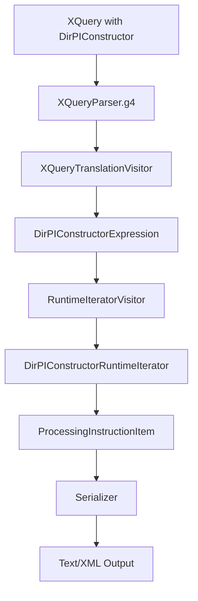

## Plan: Add Runtime Support for Direct Processing-Instruction Constructors

### 1. Current State & Gaps

- **Existing XML node items**: `TextItem`, `AttributeItem`, `ElementItem`, `DocumentItem`, and the newly added `ProcessingInstructionItem` exist under `org.rumbledb.items.xml`, with factory methods in `ItemFactory`.
- **XML constructors implemented**: Direct elements (`DirElemConstructorExpression` + `DirElemConstructorRuntimeIterator`) and computed text/document/element/attribute constructors and their runtime iterators are implemented and annotated with relevant XQuery 3.1 spec references.
- **Processing instructions now supported**:
  - `Item.isProcessingInstructionNode()` added and backed by `ProcessingInstructionItem`.
  - `DirPIConstructorExpression` and `DirPIConstructorRuntimeIterator` added, with XQuery 3.1 text quoted in code comments.
  - `XQueryTranslationVisitor` now lowers `PI` direct constructors into `DirPIConstructorExpression`.
  - `Serializer` now emits XML-style PI nodes, and document serialization delegates to child serializers.
- **Remaining gaps / limitations**:
  - Computed PI constructors (`compPIConstructor`) remain unimplemented.
  - Deep-equal semantics and node tests still do not handle PI nodes.
  - JSON/YAML serialization paths still do not have PI-specific handling.
  - End-to-end PI constructor tests have not been added yet.

### 2. Data Model Design for Processing Instruction Nodes

- **Introduce a new XML item type** `ProcessingInstructionItem` under `org.rumbledb.items.xml` that models XDM processing-instruction nodes as defined in the XDM spec ([ProcessingInstructionNode](https://www.w3.org/TR/xpath-datamodel/#ProcessingInstructionNode)):
- Fields: `target` (NCName), `content` (string), `parent` (Item, nullable), `XMLDocumentPosition documentPos`.
- Implement `Item` methods:
    - `isNode()` → `true`.
    - `isProcessingInstructionNode()` (new default method on `Item`) → `true` here, `false` elsewhere.
    - `nodeName()` to return the PI target (consistent with other node types using `nodeName()` for the name/target-like component).
    - `getStringValue()` to return the PI content (dm:string-value).
    - `atomizedValue()` to return a singleton `xs:string` with the content, similar to `TextItem`/`CommentItem`.
    - XML position and parent-handling (`setXmlDocumentPosition`, `getXmlDocumentPosition`, `setParent`, `parent`) consistent with other XML node items.
- **Extend `org.rumbledb.api.Item`**:
- Add a default method `isProcessingInstructionNode()` returning `false`.
- Keep changes minimal and in line with existing XML node flags so that consumers like deep equal or future node tests can branch on this when implemented.
- **Extend `ItemFactory`** (`org.rumbledb.items.ItemFactory`) with a factory method:
- `createXmlProcessingInstructionNode(String target, String content)` returning a new `ProcessingInstructionItem`.
- Ensure mutability/serialization are consistent with other XML node items.

### 3. Expression-Level Support for DirPIConstructor

- **Add a new expression class** `DirPIConstructorExpression` under `org.rumbledb.expressions.xml`:
- Fields:
    - `String target` (the PI target as parsed by the translator).
    - Optional `Expression contentExpression` representing enclosed expressions and literal PI content.
- Implement methods:
    - `accept(AbstractNodeVisitor<T> visitor, T argument)` → `visitor.visitDirPIConstructor(this, argument)`.
    - `getChildren()` to expose `contentExpression` when non-null.
    - `serializeToJSONiq(...)` to pretty-print an equivalent PI constructor form for debugging (e.g., `processing-instruction { "target" } { contentExpr }` or a simple placeholder, depending on what is idiomatic in the codebase).
- Add Javadoc referencing **“3.9.1.2: Direct Processing Instruction Constructors”** (exact section name/number from [DirPIConstructor](https://www.w3.org/TR/xquery-31/#doc-xquery31-DirPIConstructor)), and embed brief comments copying the relevant numbered steps from the spec, as done for other constructors.
- **Update `AbstractNodeVisitor`** to declare a visit method for the new expression:
- `T visitDirPIConstructor(DirPIConstructorExpression expression, T argument);`
- Ensure implementations (e.g., `RuntimeIteratorVisitor`, `XQueryTranslationVisitor`) are updated accordingly, and that unsupported visitors throw explicit exceptions if they are not meant to handle XML nodes.

### 4. Translation from ANTLR Parse Tree to Expression

- **Extend `XQueryTranslationVisitor`** (`org.rumbledb.compiler.XQueryTranslationVisitor`) to create `DirPIConstructorExpression` instances when encountering the `PI` alternative in `directConstructor`:
- Identify or add a parse-rule-specific visit method, likely `visitDirectConstructor` or a more specific `visitDirPIConstructor`-style method, depending on how the COMMENT alternative is (or will be) handled.
- For a DirPI constructor of the form `<?PITarget PIContent?>`:
    - Extract the **PI target** as a string (following the lexer output and grammar structure; ensure it corresponds to the NCName before any whitespace).
    - Represent the **PI content** as an `Expression`:
    - For now, follow the same strategy used for element content and text/comment constructors: treat literal PI content as a text node expression or inlined literal, and wrap enclosed expressions into the `contentExpression` when present.
- Insert spec-based validation guards on the *translated representation* only when they depend on static syntax (e.g., if the lexer allows characters that are later forbidden by the DirPI section, we preserve those checks for the runtime step instead):
    - Ensure we do **not** duplicate purely lexical restrictions that the grammar already enforces (like banning `?>` inside the literal part), to keep responsibilities clear.

### 5. Runtime Iterator for DirPIConstructor

- **Add `DirPIConstructorRuntimeIterator`** under `org.rumbledb.runtime.xml`:
- Extend `AtMostOneItemLocalRuntimeIterator`.
- Inputs:
    - A `String target`.
    - An `AtomizationIterator` for the content expression (mirroring how `TextNodeConstructorRuntimeIterator` and `CommentNodeConstructorRuntimeIterator` are wired).
- Implement `materializeFirstItemOrNull(DynamicContext dynamicContext)` according to **XQuery 3.1, Direct Processing Instruction Constructors** ([DirPIConstructor](https://www.w3.org/TR/xquery-31/#doc-xquery31-DirPIConstructor)) and the XDM PI node semantics ([ProcessingInstructionNode](https://www.w3.org/TR/xpath-datamodel/#ProcessingInstructionNode)):
    - **Content handling**:
    - Atomize the content expression to a sequence of atomic values.
    - If the result is an empty sequence, no PI is constructed (return `null`), aligning with how empty content is treated in similar constructors.
    - Otherwise, cast each atomic value to string and **concatenate with single spaces** between values (reusing the same pattern as comment/text node constructors where applicable), yielding a single string `S`.
    - **Whitespace normalization**:
    - Apply the DirPI-specific whitespace rules (e.g., trim the leading whitespace between the target and the first content character as per the numbered steps in the spec); include line comments quoting the corresponding points from the spec.
    - **Name and content validation**:
    - Ensure the **target is a valid NCName** (if not already guaranteed by the parser): if invalid, raise the appropriate dynamic error code as described in the DirPI section.
    - Check for forbidden character sequences in the content (e.g., ensure that the resulting string does not contain `"?>"` when combined with the PI closing delimiter, per the spec’s constraints), and raise the corresponding dynamic error if violated (similar to the guard for `--` in comments with `InvalidCommentContentException`).
    - **Node creation**:
    - If all checks pass, call `ItemFactory.getInstance().createXmlProcessingInstructionNode(target, content)`.
    - Ensure `hasNext` is set to `false` after constructing the node.
- **Wire from expression to runtime**:
- Extend `RuntimeIteratorVisitor` (or the relevant visitor in `org.rumbledb.compiler`) to map `DirPIConstructorExpression` to `DirPIConstructorRuntimeIterator`, wrapping the content expression into an `AtomizationIterator` as is done for text/comment constructors.

### 6. Integration into XML Tree-Building and Document Positioning

- **Tree integration**:
- Confirm that PIs can appear wherever nodes are collected (document children, element content) by reusing the same list structures as for other node types:
    - Dir element constructor runtime building (`DirElemConstructorRuntimeIterator`) should naturally handle PI items as non-text nodes appended to the `content` list, just as it does for elements and comments.
    - Document node constructor runtime (`DocumentNodeConstructorRuntimeIterator`) should treat PIs as regular nodes in its `contentSequence` processing (no extra restrictions in the doc constructor spec beyond attributes/namespace nodes); verify this behavior and adjust only if the spec requires special treatment.
- **Document position and parent handling**:
- Follow the same patterns as `TextItem`, `CommentItem`, and `ElementItem`:
    - Ensure `ProcessingInstructionItem#setXmlDocumentPosition` and `getXmlDocumentPosition` correctly participate in recursive numbering from top-level iterators (e.g., document and dir element constructors).
    - When parent nodes call `addParentToDescendants()`, PIs in the child lists should get their `parent` set correctly and contribute to position numbering.

### 7. Serialization of Processing Instruction Nodes

- **Extend `Serializer`** (`org.rumbledb.serialization.Serializer`) to support PI nodes in the XML-like output branch:
- After the existing `isCommentNode()` branch, add handling for `isProcessingInstructionNode()`:
    - Output an XML-like PI: `<?` + `item.nodeName()` (target) + optional space + `item.getStringValue()` (content) + `?>` followed by newline.
- Ensure PIs are serialized both when they appear directly in the result sequence and when nested inside document/element nodes.
- **JSON/YAML modes**:
- Preserve existing behavior (these modes currently serialize only JSON-like structures and atomic values). For now, we can either:
    - Leave PIs unsupported in JSON/YAML and rely on the fact they will normally be used with XML output; or
    - Serialize them via `getStringValue()` as plain strings when forced into JSON/YAML.
- Document this limitation briefly in code comments if we choose the first option.

### 8. Error Handling & Exceptions

- **Define/Reuse exceptions**:
- If necessary, introduce a PI-specific exception (e.g., `InvalidProcessingInstructionContentException`) under `org.rumbledb.exceptions`, similar to `InvalidCommentContentException`, mapping to the correct XQuery/XDM error code.
- Ensure error messages include enough context and refer to the relevant XQuery 3.1 error identifiers from the DirPI section.
- **Guardrails in visitors**:
- In visitors or runtime code paths that are not supposed to see PIs yet, either handle them generically as nodes or throw a clear `UnsupportedFeatureException` so that scope remains explicit.

### 9. End-to-End Testing Strategy (spark-submit)

- **Positive tests** (via `spark-submit ... --default-language xquery31`):
- Simple PI at top level: `<?pi-target content?>` should produce a PI node that serializes as `<?pi-target content?>`.
- PIs inside direct elements: `<root><?pi-a a?></root>` and with enclosed expressions (once supported) should yield document output with nested PIs.
- PIs inside document node constructors: `document { <?pi-doc doc?> }` should result in a document whose serialized children include the PI.
- **Negative tests** (based on DirPI spec rules):
- Invalid targets (non-NCName) should raise the specified dynamic error.
- Content that violates the PI lexical constraints (e.g., resulting in `?>` in the combined PI) should raise the appropriate error.
- Empty content sequence where no PI should be constructed (test that result is the empty sequence in contexts similar to text/comment constructors).
- **Behavioral checks**:
- Verify that parent/child relationships and document positions are set (e.g., by inspecting behavior in expressions that navigate children or by extending unit tests later).

### 10. Known Limitations & Follow-Ups (Out of Scope for This Task)

- **Computed PI constructors** (`compPIConstructor`) remain unimplemented and will be tackled in a separate task, potentially reusing the same `ProcessingInstructionItem` and content-handling logic.
- **Deep equal semantics** and node tests for PIs are still TODOs; once PI items exist, we should:
- Extend deep equal to treat PIs according to XDM rules.
- Extend XML `node_test` and any type system components to recognize PIs where appropriate.
- **Namespace and base-uri facets** for PIs are not modeled yet and align with broader XML/XDM type-system work planned elsewhere.

### Mermaid Overview of the New Flow

